# langchain4j-agentic 框架梳理

> 基于 [langchain4j-agentic](https://github.com/langchain4j/langchain4j/tree/main/langchain4j-agentic) 源码与 [agentic-tutorial](https://github.com/langchain4j/langchain4j-examples/tree/main/agentic-tutorial) 示例工程整理。

---

## 一、框架思想（概要）

langchain4j-agentic 是 LangChain4j 的**智能体编排层**，核心思想可以概括为：

1. **声明式 Agent 定义**：用接口 + `@Agent` / `@SequenceAgent` / `@ParallelAgent` 等注解描述“谁做什么、如何编排”，而不是手写调用链。
2. **统一编排抽象**：所有编排（顺序、并行、条件、循环、监督者）都抽象成 **Planner + AgenticScope**：Planner 决定“下一步调用谁”，Scope 在各 Agent 之间共享输入/输出状态。
3. **单 Agent = AiServices + 工具**：每个叶子 Agent 由 `AgentBuilder` 包装成基于 LangChain4j `AiServices` 的代理，可挂 Tool、RAG、Guardrail 等。
4. **可组合、可观测**：支持子 Agent 组合成复合 Agent、Human-in-the-loop、监听器（AgentListener）与监控（AgentMonitor）。

---

## 二、结构图（概要）

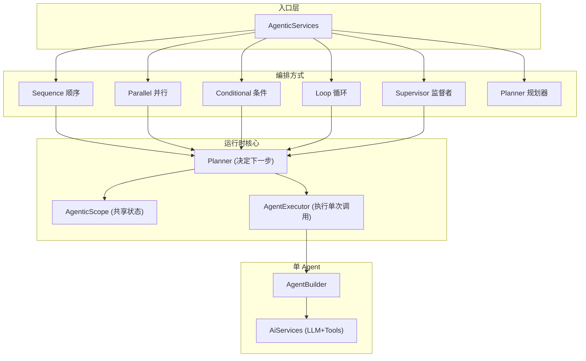

---

## 三、结构图（详细）

### 3.1 包与模块划分

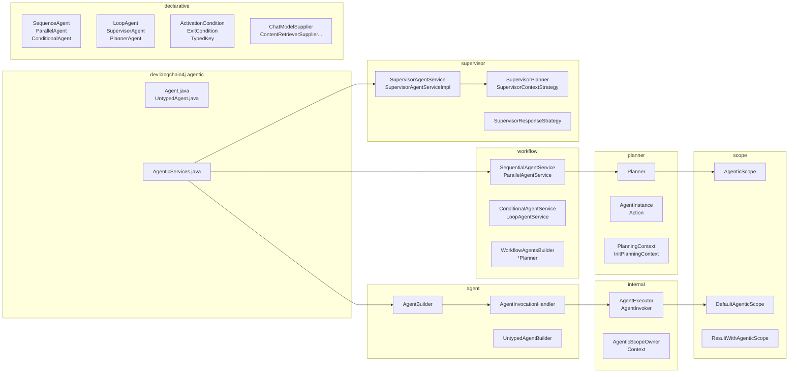

### 3.2 与示例工程的对应关系

| 示例目录 (agentic-tutorial) | 使用的框架能力 |
|-----------------------------|----------------|
| `_1_basic_agent` | `AgenticServices.agentBuilder(Class)`、`@Agent` |
| `_2_sequential_workflow` | `sequenceBuilder()`、`outputKey`、Scope 状态传递 |
| `_3_loop_workflow` | `loopBuilder()`、`ExitCondition`、循环直到条件满足 |
| `_4_parallel_workflow` | `parallelBuilder()`、多子 Agent 并行执行 |
| `_5_conditional_workflow` | `conditionalBuilder()`、`@ActivationCondition` 路由 |
| `_6_composed_workflow` | 顺序/并行/条件等组合成更大工作流 |
| `_7_supervisor_orchestration` | `supervisorBuilder()`、监督者动态选子 Agent |
| `_8_non_ai_agents` | 非 AI 的“Agent”（纯函数）参与编排 |
| `_9_human_in_the_loop` | `humanInTheLoopBuilder()` |
| `_a_react` | 单 Agent + Tools（ReAct 风格） |
| `_b_plan_and_execute` | `plannerBuilder()`、自定义 Planner |

---

## 四、核心类图

### 4.1 入口与 Builder

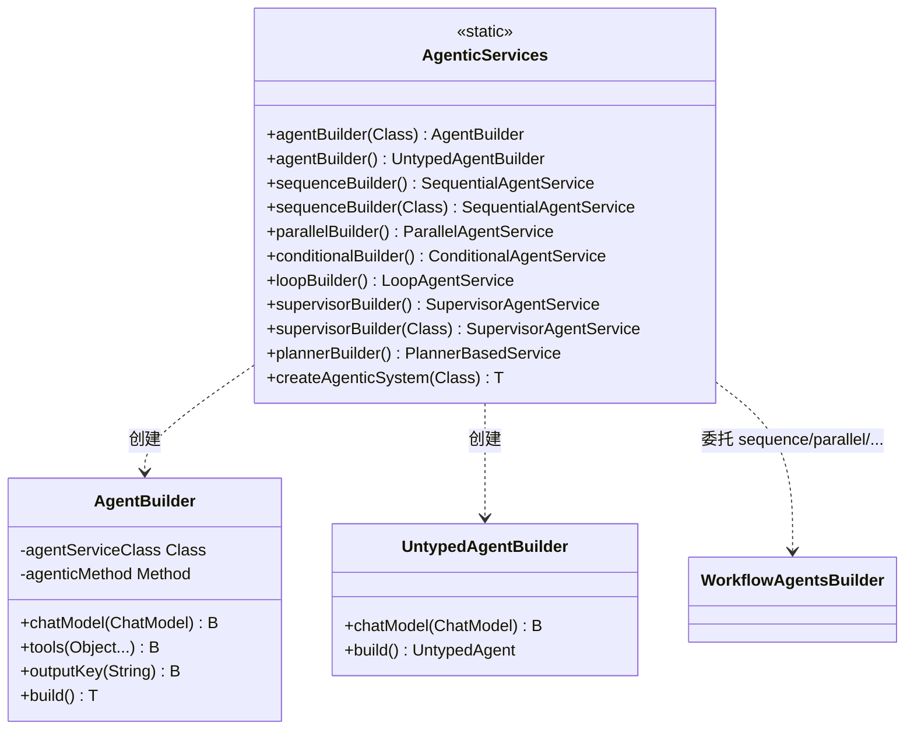

### 4.2 Agent 与执行链

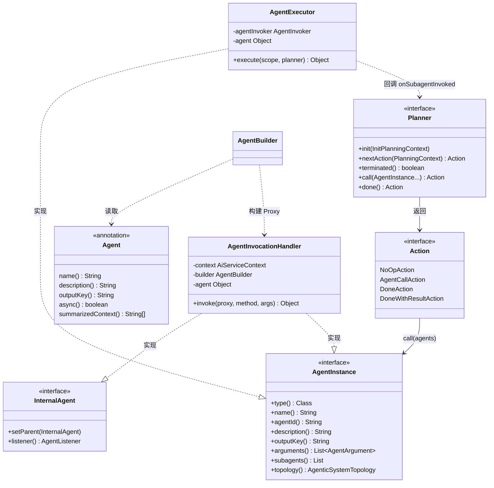

### 4.3 AgenticScope 与状态共享

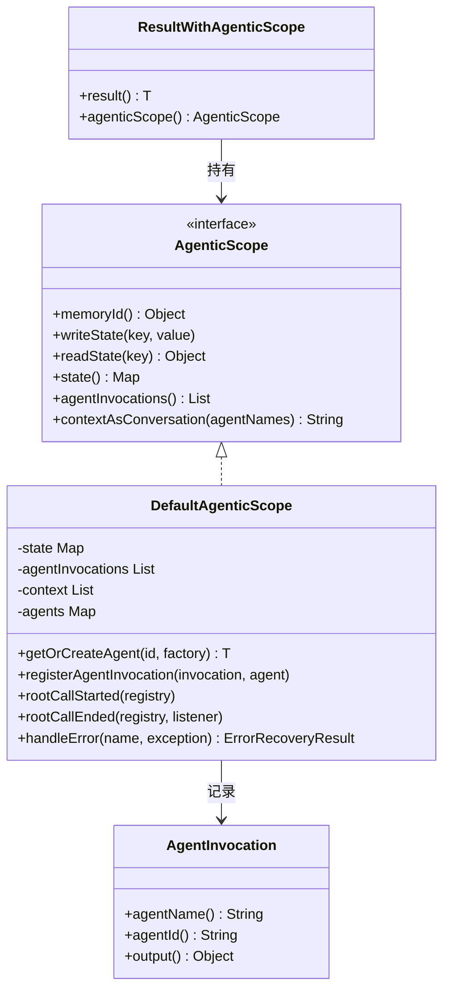

### 4.4 声明式注解与工作流服务

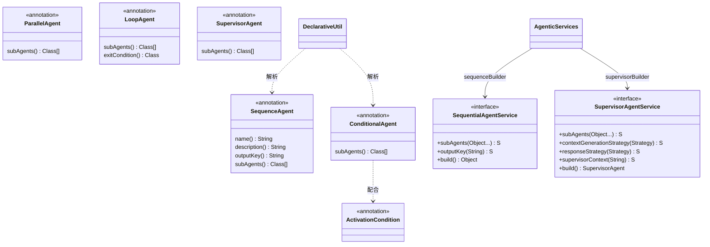

---

## 五、执行流程

所有编排都遵循同一套**执行壳**：入口方法被调用 → 解析参数并写入 **AgenticScope** → 用 **Planner** 驱动循环：每次取 **Action**（`call(agent)` 或 `done(result)`）→ 若是 `call`，则 **AgentExecutor.execute(scope, planner)** 执行子 Agent、把结果写回 Scope、并回调 **planner.onSubagentInvoked** 以得到下一步 Action → 直到 `done`，再根据 **outputKey** 从 Scope 取最终结果并返回。下面按场景用时序图细化。

---

### 5.1 单次调用（叶子 Agent）

单 Agent 由 `AgentBuilder.build()` 生成：内部用 **AiServices** 构造真实实现类，再包一层 **Proxy**，**InvocationHandler** 为 **AgentInvocationHandler**。用户调用接口方法时，最终落到 AiServices 生成的实现类上，从而走 LangChain4j 的 chat/tool 调用链。

**要点**：`invoke` 里会先处理 `AgenticScopeOwner`、`ChatMemoryAccess`、`AgentInstance` 等接口；只有“业务方法”才转发给内部 `agent`（AiServices 实例），由 AiServices 去调 ChatModel / Tools。

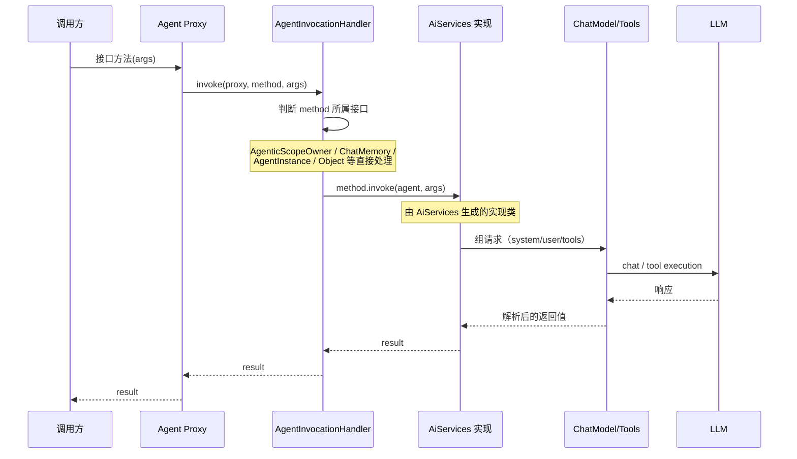

**流程简述**：Caller → Proxy → AgentInvocationHandler（分支处理）→ 业务方法转发到 AiServices 实现 → ChatModel/Tools → LLM → 原路返回。

---

### 5.2 顺序工作流（Sequence）

顺序工作流由 **PlannerBasedInvocationHandler** 作为入口；其内部 **PlannerLoop** 持有一个 **Planner**（顺序场景下为 **SequentialPlanner**），通过 `firstAction` / `nextAction` 驱动“当前应执行哪个子 Agent”，并由 **AgentExecutor** 执行子 Agent，子 Agent 的返回值写回 Scope，再通过 **onSubagentInvoked** 向 Planner 索取下一步 Action，直到 Planner 返回 `done`。

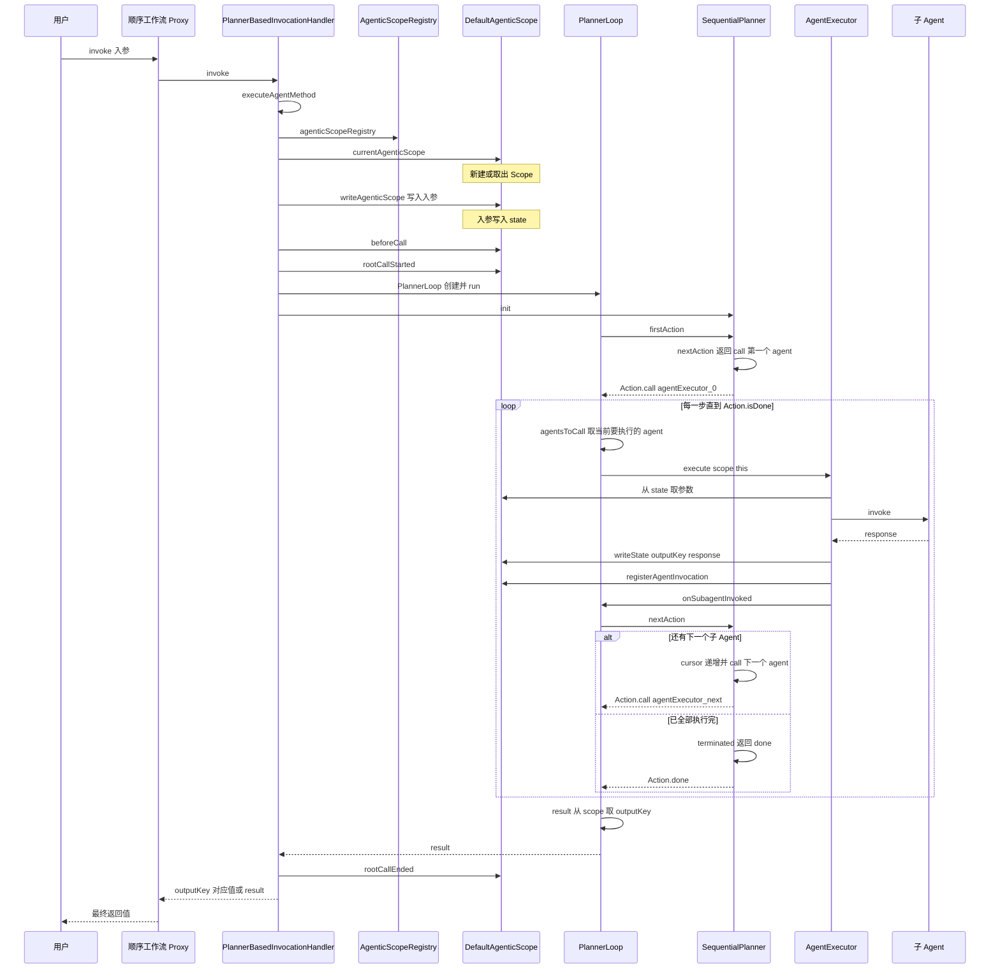

**流程简述**：创建/获取 Scope → 入参写入 Scope → PlannerLoop 循环：Planner 返回 `call(下一个 Agent)` → AgentExecutor 执行该 Agent、写 Scope、注册调用记录 → 回调 `onSubagentInvoked` → Planner 返回下一步（继续 `call` 或 `done`）→ 直至 `done`，从 Scope 按 outputKey 取结果并返回。

---

### 5.3 监督者工作流（Supervisor）

监督者与顺序工作流共用 **PlannerBasedInvocationHandler + PlannerLoop**，区别在于 **Planner** 为 **SupervisorPlanner**：每一步不按固定顺序，而是把当前 Scope 中的 request、上一轮子 Agent 的 lastResponse、以及可选摘要/对话历史交给 **PlannerAgent**（由 LLM 实现的“规划器”），由 LLM 决定下一步调用哪个子 Agent（及参数），或返回 **done**。最终结果按 **SupervisorResponseStrategy**（LAST / SUMMARY / SCORED）从 lastResponse 或 done 的 response 中得出。

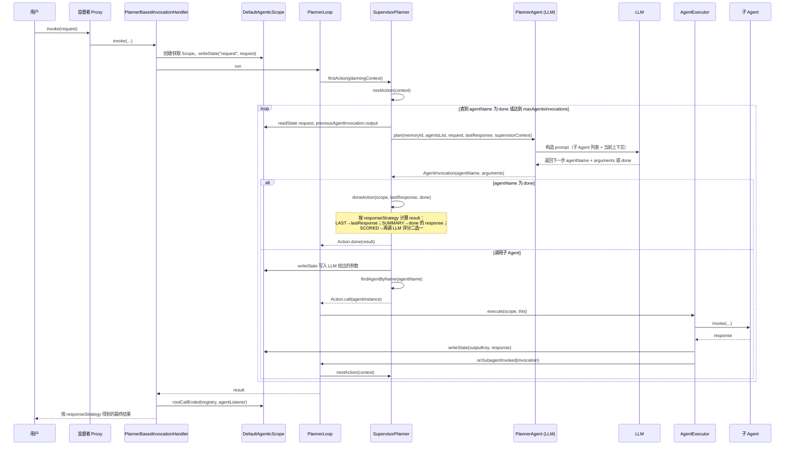

**流程简述**：每步 SupervisorPlanner 用 PlannerAgent（LLM）根据当前 request + lastResponse + 可选摘要决定“调用谁 / 传什么参数 / 是否 done” → 若 call 则执行对应 AgentExecutor 并写 Scope，再 nextAction → 若 done 则按 LAST/SUMMARY/SCORED 算最终 result 并结束循环。

---

### 5.4 Human-in-the-Loop 工作流

Human-in-the-Loop 是在**顺序（或其它）工作流**中插入一个“人工步骤”：该步骤对应的“Agent”由 **HumanInTheLoop** 实现，内部不调 LLM，而是通过 **responseProvider.apply(scope)** 向用户展示提示（如用 requestWriter 从 scope 取 inputKey 展示）、阻塞等待用户输入（如 responseReader），再把用户输入写回 Scope 的 outputKey，供后续步骤使用。从编排视角看，它和普通子 Agent 一样被 Planner 以 `call(humanInTheLoopExecutor)` 的方式调度。

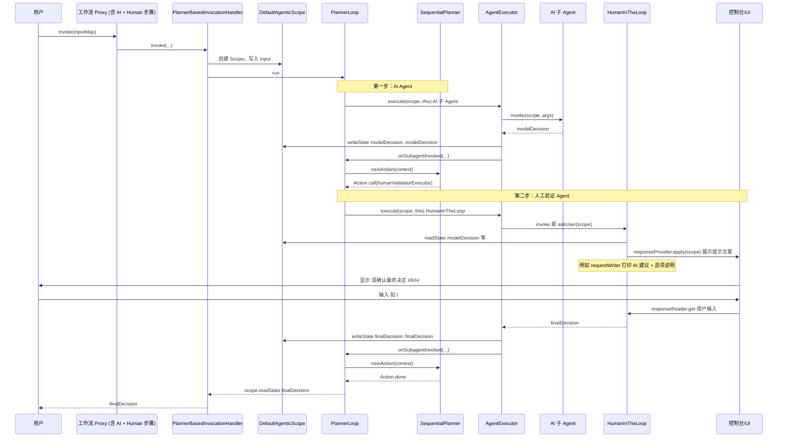

**流程简述**：工作流按顺序执行；当某一步是 HumanInTheLoop 时，AgentExecutor 执行的是 `responseProvider.apply(scope)`：从 Scope 取需要展示的内容、向用户展示并阻塞等待输入、将用户输入写回 Scope 的 outputKey，后续步骤与普通 Agent 一致（从 Scope 读、写，Planner 继续 nextAction 直至 done）。

---

### 5.5 声明式 createAgenticSystem 流程

通过 **AgenticServices.createAgenticSystem(agentServiceClass)** 或重载（带 ChatModel、agentConfigurator）创建 Agent 时，会先尝试按**声明式注解**解析该类：若存在 `@SequenceAgent` / `@ParallelAgent` / `@ConditionalAgent` 等，则走 **createComposedAgent**，递归为子 Agent 类创建实例并交给 WorkflowAgentsBuilder 组装成顺序/并行/条件等复合 Agent；否则退化为 **agentBuilder(agentServiceClass).build()**，得到单个叶子 Agent（Proxy + AgentInvocationHandler）。

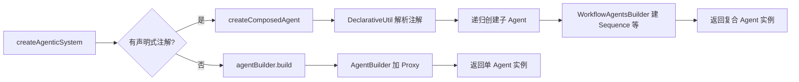

---

## 六、关键概念小结

| 概念 | 说明 |
|------|------|
| **AgenticScope** | 一次“根调用”内的共享状态；子 Agent 的 input/output 通过 `readState`/`writeState` 传递。 |
| **Planner** | 决定下一步执行哪个 Agent、何时结束；Sequence/Parallel/Conditional/Loop/Supervisor 各有实现。 |
| **AgentInstance** | 对“可被编排的一步”的抽象，既可能是叶子 Agent（AI），也可能是复合 Agent（带 subagents）。 |
| **Action** | Planner 返回的下一步：`call(agent(s))` 或 `done(result)`。 |
| **outputKey** | 子 Agent 的返回值写入 Scope 的键，供后续 Agent 或最终输出使用。 |
| **SupervisorContextStrategy** | 监督者如何把“已执行过的子 Agent 对话”带给 LLM：CHAT_MEMORY / SUMMARIZATION / CHAT_MEMORY_AND_SUMMARIZATION。 |
| **SupervisorResponseStrategy** | 监督者最终返回什么：LAST（最后一环输出）/ SUMMARY（done 时的总结）/ SCORED（用 LLM 评分二选一）。 |

---

## 七、参考链接

- 框架源码：[langchain4j/langchain4j-agentic](https://github.com/langchain4j/langchain4j/tree/main/langchain4j-agentic)
- 示例工程：[langchain4j-examples/agentic-tutorial](https://github.com/langchain4j/langchain4j-examples/tree/main/agentic-tutorial)
- 
