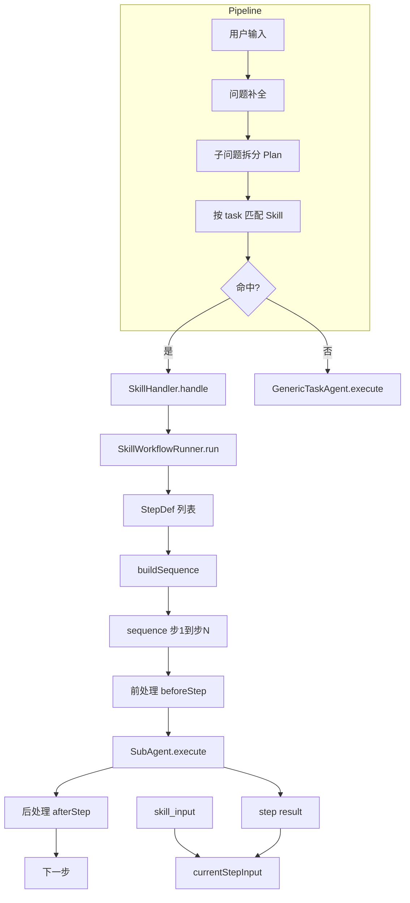
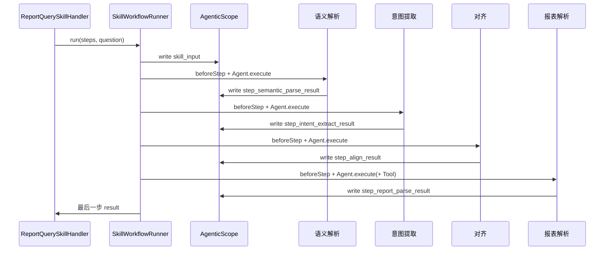
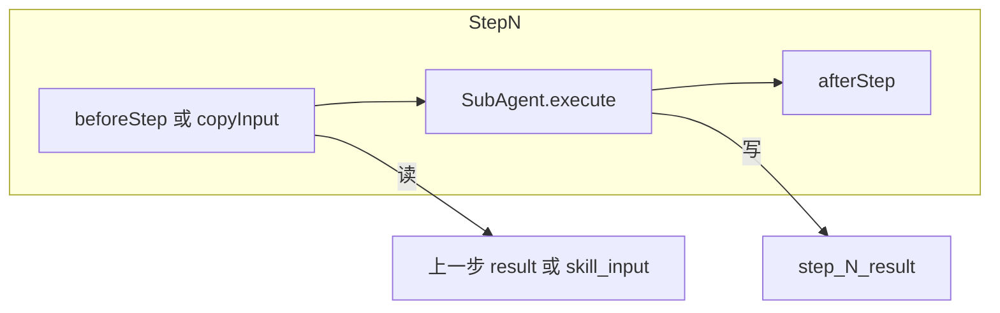

# Agent 开发流程与架构（以报表查询为例）

本文说明如何像「报表查询」一样，开发一个多步 SubAgent 编排的 Skill：从 Skill 定义、步骤配置、SubAgent/StepProcessor 实现，到注册与运行。

---

## 一、整体架构图



---

## 二、报表查询 4 步数据流



- 每步的 **beforeStep** 从上一步的 `step_*_result`（或首步从 `skill_input`）读入，整理后写入 `currentStepInput`，再调用本步 SubAgent。
- SubAgent 只关心 `execute(currentStepInput)`，结果由 Runner 写入 `step_{id}_result`。
- 下一步的 beforeStep 再读上一步的 `step_*_result`，形成链式数据流。

---

## 三、开发流程（与报表分析一致）

### 1. 定义 Skill（md）

在 `src/main/resources/skills/` 下新增 `{skill_id}.md`，YAML front matter 至少包含：

- **id**：唯一标识，与 handlerId 可一致。
- **name** / **description**：供 LLM 路由与展示。
- **handlerId**：与下面注册的 Handler 的 key 一致。
- **keywords**：可选，用于关键词匹配或说明。

示例见 `report_query.md`。

### 2. 定义步骤配置（JSON，可选）

在 `src/main/resources/skills/steps/` 下新增 `{handlerId}.json`，例如 `report_query.json`：

```json
{
  "steps": [
    { "id": "step1", "name": "步骤1", "agentId": "agent1", "preProcessorId": "proc1", "postProcessorId": "proc1" },
    { "id": "step2", "name": "步骤2", "agentId": "agent2", "toolIds": ["relativeTimeResolver"] }
  ]
}
```

- **agentId**：必须在 SubAgentRegistry 中注册。
- **preProcessorId / postProcessorId**：可选，须在 StepProcessorRegistry 中注册。
- **toolIds**：可选，本步挂载的 Tool 或 GroupTool 的 id/groupId。
- **agentRetryCount**、**stepTimeoutMs**（-1 表示不超时）、**catchBeforeStepError** / **catchAgentError** / **catchAfterStepError** 按需配置。

不提供 JSON 时，Handler 内使用代码里的 defaultSteps()。

### 3. 实现 SubAgent 接口

每个“步”对应一个 SubAgent：继承或符合 `SubAgent` 契约（`String execute(String currentStepInput)`），用 `@SystemMessage` / `@UserMessage` 等描述 prompt，由 AiServices 生成实现类。

- 放在独立子包中，例如 `skill.agentic.report`。
- 在常量类中定义 agentId（如 `Agentic311Constants.Report`），与 StepDef 的 agentId 一致。

### 4. 实现 StepProcessor（可选）

若步骤需要“读上一步结果 → 拼 prompt → 再调 Agent”，可为本步配一个 StepProcessor：

- **beforeStep(scope, stepId, previousOutputKey)**：从 scope 读 `previousOutputKey`，拼好本步输入，写入 `currentStepInput`。
- **afterStep(scope, stepId, stepResultKey)**：可选，对本步结果做清洗或写回 scope 其他 key。

在常量类中定义 processorId，并在 Config 的 `@PostConstruct` 中注册到 `StepProcessorRegistry`。

### 5. 注册到平台

在**本 Skill 的 Config 类**（如 `ReportAgenticConfig`）中：

1. **SubAgentRegistry**：`register(agentId, XxxAgent.class)`。
2. **StepProcessorRegistry**：`register(processorId, xxxStepProcessor)`。
3. **ToolRegistry**：若用 Tool，在 `SkillAgenticConfig` 或本 Config 中 `register(toolId, tool)`；StepDef 的 `toolIds` 填 id 或 groupId。
4. **SubAgentInstanceRegistry**（可选）：若希望“实例路径”带 catchAgentError，则 `register(agentId, xxxAgentBean)`。
5. **Bean**：每个 SubAgent 接口用 `AiServices.builder(XxxAgent.class).chatModel(chatModel).build()` 暴露为 Bean。
6. **ReportQuerySkillHandler**：`@Bean` 方法中 `new ReportQuerySkillHandler(skillWorkflowRunner, stepDefLoader.load(handlerId))`，steps 为 null 时用 `defaultSteps()`。

在**统一 Handler 注册处**（如 `SkillDemoConfig.skillHandlerRegistry`）：
`register(handlerId, reportQuerySkillHandler)`。

### 6. Handler 实现

SkillHandler 只需在 `handle(executableQuestion, plan)` 中调用：

- `workflowRunner.run(steps, executableQuestion)`
  其中 `steps` 来自 StepDefLoader.load(handlerId) 或 defaultSteps()。

---

## 四、报表查询 4 步与类对应关系


| 步骤 id        | name     | agentId        | StepProcessor       | 说明                                               |
| -------------- | -------- | -------------- | ------------------- | -------------------------------------------------- |
| semantic_parse | 语义解析 | semantic_parse | report_semantic     | 从用户问题解析语义结构                             |
| intent_extract | 意图提取 | intent_extract | report_intent       | 提取查询意图                                       |
| align          | 对齐     | align          | report_align        | 与业务口径对齐                                     |
| report_parse   | 报表解析 | report_parse   | report_report_parse | 生成报表结果，可挂 Tool（如 relativeTimeResolver） |

- **Agent 类**：SemanticParseAgent、IntentExtractAgent、AlignAgent、ReportParseAgent（均在 `skill.agentic.report` 包）。
- **StepProcessor**：SemanticParseStepProcessor、IntentExtractStepProcessor、AlignStepProcessor、ReportParseStepProcessor；beforeStep 中从 scope 读上一步结果并拼 prompt，写入 currentStepInput。
- **步骤配置**：`skills/steps/report_query.json` 或 ReportQuerySkillHandler.defaultSteps()。

---

## 五、SkillWorkflowRunner 单步执行结构



- 重试、步超时（stepTimeoutMs）、workflow 超时均由 Runner 统一支持；StepDef 中配置即可。
- Tool 通过 StepDef.toolIds 挂到对应步，Runner 用 ToolRegistry 解析为实例或 GroupTool 后交给 builder。

---

## 六、扩展新 Skill 检查清单

1. [ ]  `src/main/resources/skills/{id}.md` 已添加，handlerId 与注册一致。
2. [ ]  可选：`src/main/resources/skills/steps/{handlerId}.json` 已添加。
3. [ ]  SubAgent 接口与实现类已写，并在本 Skill Config 中注册到 SubAgentRegistry、暴露为 Bean。
4. [ ]  若用前/后处理：StepProcessor 已实现并注册到 StepProcessorRegistry。
5. [ ]  若用 Tool：Tool 已注册到 ToolRegistry，StepDef 中 toolIds 已填。
6. [ ]  SkillHandler 已实现并注入 SkillWorkflowRunner、steps（StepDefLoader 或 defaultSteps）。
7. [ ]  SkillHandlerRegistry 中已 register(handlerId, handler)。

完成上述后，流水线会按 task 的 question 做 Skill 匹配，命中后调用对应 Handler，多步由 SkillWorkflowRunner 按 sequence 执行。
